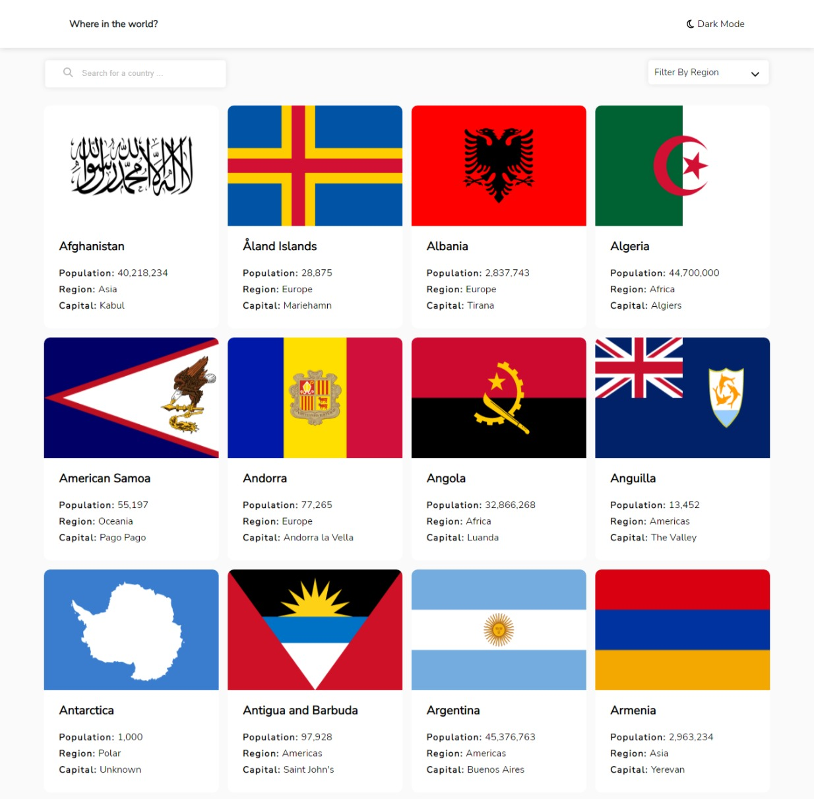
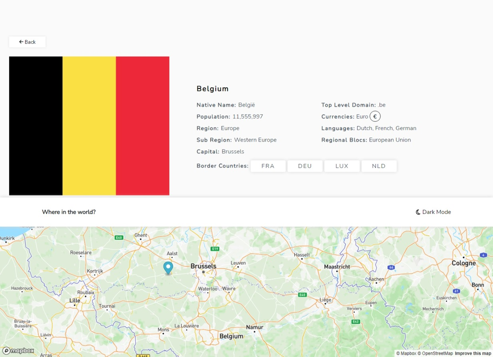

# REST Countries API with color theme switcher

This is a solution to the [REST Countries API with color theme switcher challenge on Frontend Mentor](https://www.frontendmentor.io/challenges/rest-countries-api-with-color-theme-switcher-5cacc469fec04111f7b848ca). Frontend Mentor challenges help me improve my coding skills by building realistic projects.

## Table of contents

- [Overview](#overview)
  - [The challenge](#the-challenge)
  - [Screenshot](#screenshot)
  - [Links](#links)
- [My process](#my-process)
  - [Built with](#built-with)
  - [What I learned](#what-i-learned)
  - [Useful resources](#useful-resources)
- [Author](#author)
- [Installation](#installation)

## Overview

### The challenge

Users should be able to:

- See all countries from the API on the homepage
- Search for a country using an `input` field
- Filter countries by region
- Click on a country to see more detailed information on a separate page
- See country location on google map. (additional)
- Toggle the color scheme between light and dark mode *(optional)*

### Screenshot




### Links

- Live Site URL: [https://rest-countries-api-with-color-theme-switcher-azure.vercel.app/](https://rest-countries-api-with-color-theme-switcher-azure.vercel.app/)

## My process

### Built with

- HTML
- CSS custom properties
- Flexbox
- Mobile-first workflow
- [React](https://reactjs.org/) - JS library
- it is a [Progressive Web App](https://facebook.github.io/create-react-app/docs/making-a-progressive-web-app)

### What I learned

I learned how to integrated maps and fontawesome icons in react app
To see how you can add code snippets, see below:

```js
onst map = new mapboxgl.Map({
      container: 'map',
      style: 'mapbox://styles/mapbox/streets-v12',
      center: [location.state.latlng[1], location.state.latlng[0]],
      zoom: 7,
    });
    const marker = new mapboxgl.Marker().setLngLat([location.state.latlng[1], location.state.latlng[0]]).addTo(map)
```

### Useful resources

- [https://docs.mapbox.com/mapbox-gl-js/guides/](https://docs.mapbox.com/mapbox-gl-js/guides/) - This repo helped me how to render map component in the browser using  MapBox Maps Gl.
- [https://fontawesome.com/v5/docs/web/use-with/react](https://fontawesome.com/v5/docs/web/use-with/react) - helped me understand how to integrate fontawesome in react app.

## Author

- Frontend Mentor - [@mohamedhesham221](https://www.frontendmentor.io/profile/mohamedhesham221)
- Linkedin - [Muhammad Hisham](https://www.linkedin.com/in/muhammad-hisham-23544b253/)

## Installation

- clone the repo `git clone https://github.com/mohamedhesham221/REST-countries-API-with-color-theme-switcher`.
- install dependencies `npm install`.
- start project with `npm start`.
- it can be viewed in the browser at `http://localhost:3000`.
- build the app for production to the `build` folder.\ `npm run build`.
